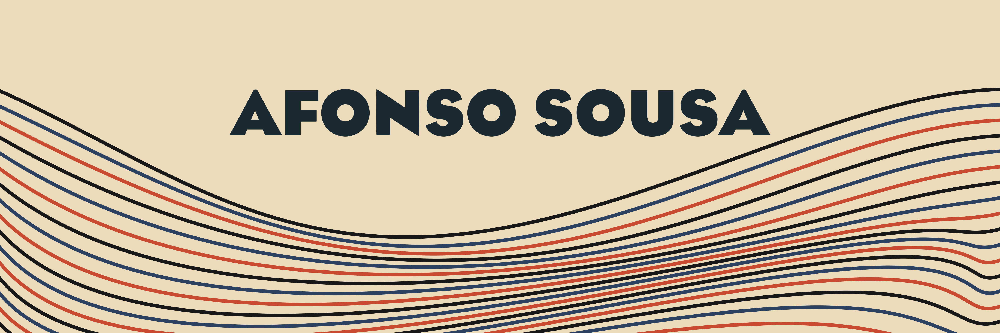

Welcome 👋

I’m Afonso, a teaching assistant, PhD student, and aspiring data scientist. I mainly work on paraphrase generation.

🔭 In my spare time, I play with other technologies, like web dev ([personal portfolio](https://afonsousa.com/)), game dev ([Space Snatchers](https://play.google.com/store/apps/details?id=org.afonsousa.SpaceSnatchers&hl=pt_PT), an Android game), or app dev ([Tomate](https://play.google.com/store/apps/details?id=org.afonsousa.tomate&hl=pt_PT), an Android app).

 

## 💼 Skills

