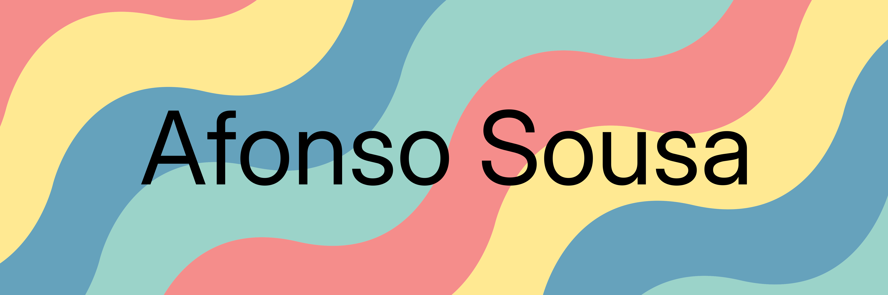

Welcome 👋

I’m Afonso, a junior researcher, PhD student and aspiring data scientist. I mainly develop Deep Learning-based solutions for Natural Language Processing.

🔭 In my free time, I work on [catbird](https://github.com/AfonsoSalgadoSousa/catbird), an open-source toolkit for paraphrase generation.

 

## 💼 Skills

